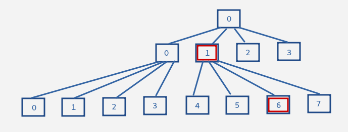

# 起動

`npx http-server . -p 8080`を使う。

```
$ cd <this porject root>

$ npx http-server . -p 8080
```

その後、ブラウザから`http://localhost:8080`へアクセス。

# CollisionDetectroの切り替え

`index.js`の中段

```js
const collisionDetector = new QuadTreeCollisionDetector(CANVAS_WIDTH, CANVAS_HEIGHT, 2);
//const collisionDetector = new RoundrobinCollisionDetector();
```

これのコメントアウトを切り替えると切り替わる。

# 効率的な衝突判定について

詳細は「衝突判定 四分木 モートン」辺りで検索をかければ出てくるので割愛。
大雑把に書くと、

1. 空間を四分木によって管理する(分割されていない空間をrootとして、四分割していく)
2. 各ノードにおいて、同じノードに含まれるもののみの衝突判定を行う
3. 各ノードにおいて、自身の祖先ノードに含まれるものは衝突する可能性があるので衝突判定を行う

ということをする。これらを効率的に行うために、

1. 分割した空間のインデックスはモートン順序に従って振りわける
2. オブジェクトのネストによって再現される木構造はアクセスに時間がかかるので線形(配列)によって木構造を管理する
3. 各ノードの祖先ノードに含まれるオブジェクトを参照するために、毎回木構造を遡るのは大変なので、工夫してこれを防ぐ

ということを行う。

## 四分木構造について



四分木において、`[0 (root)]-[1]-[6]` の関係について見てみる。

rootを`level0`とした時、`level1`のノードである`1`というインデックスを2進数で表現すると`01`となる。次に、`level2`のノードである`6`というインデックスを2進数で表現すると`0110`である。次に、`0110`を右に2シフトすると`01`となり、自身の親ノードのインデックスと等しくなる。

逆に、`level1`のノードである`1`というインデックスを2進数で表現した`01`を左に2シフトすると、`0100`となり、これは、自身の子供ノードの最初のインデックスである`5`と等しくなる。`6`は`5`からひとつ進んだ位置にあるので、下位2bitの値が`01`になっている。その次の`7`なら下位2bitが`10`となるので、`0110`である。

これは、`[0]-[1]-[7]`においても、`[0]-[0]-[1]-[5]`においても同じことが言える。

つまり、四分木においては、シフト演算で自身の親ノードの(親ノードが所属しているレベルにおける)インデックスと、自身の子の(子ノードが所属しているレベルにおける)最初のノードのインデックスを取得することが出来る。

ここを起点にして、一つ進めば必要な下位ビット(四分木なら2bit)を操作することで、特定のノードのそのレベルにおけるインデックスを得ることが出来るし、自身のノードがどの経路を辿ったのかが分かる。これは単に最上位から2bitずつ見ていけば良い。例えば`0011011000`なら、`00 11 01 10 00`となり、

1. `00` : ルートノード
2. `11` : 3番目のノード
3. `01` : 1番目のノード
4. `10` : 2番目のノード
5. `00` : 0番目のノード

という経路を知ることが出来る。